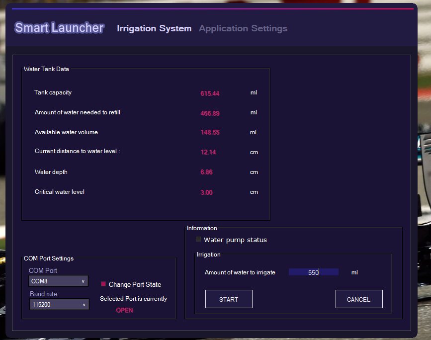

# SmartLauncher Final Version
Ultima versiune a aplicatiei SmartLauncher pentru etapa nationala

SmartLauncher este o aplicatie de tip desktop GUI care este realizata in C# cu ajutorul framework-ului .NET care primeste si furnizeaza date catre o placa de dezvoltare Wifi NodeMCU ESP8266. Aici am dorit sa construiesc o mini sera. Pe partea de hardware, proiectul este alcatuit din :
1. Un recipient ce simuleaza un bazin cu apa.
2. Un senzor HC-SR04 situat pe capacul recipientului avand scopul de a masura distanta pana la nivelul apei. Cu ajutorul distantei masurate de acest senzor reies mai multe variabile precum : cantitatea de apa necesara pentru a umple bazinul, volumul curent de apa din bazin cat si in mod evident distanta pana la nivelul apei.
3. Un senzor DS18B20 rezistent la apa aflat la fundul bazinului ce masoara temperatura apei din bazin.
4. O pompa submerisibila alimentata la 3.3V care atunci cand este alimentata de curent trimite apa printr-un tub catre acest recipient care simileaza solul serei - locul in care va ajunge apa pentru a iriga solul.
5. Un senzor DHT11 folosit pentru a determina temperatura si umiditatea aerului.
6. Un senzor BMP280 ce ofera presiunea atmosferica.
7. Un modul buzzer care este activ (bipaie) cat timp pompa este activa pe modul automat.
8. Un senzor ce masoara umiditatea solului.
9. Un releu folosit cu scopul de a controla circuitul pompei, astfel pompa este alimentata doar in momentul dorit. Este un releu de tip low level ce inseamna ca acesta trimite curent in momentul in care este setat pe LOW. 

Inainte de a utiliza in orice scop aplicatia, clientul trebuie sa selecteze portul COM corespunzator placii de dezvoltare, cat si BaudRate-ul pe care functionaza aceasta, apoi sa apese pe butonul "Change Port State" pentru a inchide / deschide portul. Pe partea de setari, utilizatorul poate alege dintre cele doua tipuri de bazine : cilindric sau paralelipipedic. Acesta va trebui apoi sa introduca inaltimea bazinului, iar daca a selectat bazinul cilindric interfata va afisa un textbox in care sa introduca diametrul bazinului, iar pentru varianta de bazin paralelipipedic acesta va introduce latimea si lungimea bazinului. Calcule precum aria bazei, volumul apei din bazin, inaltimea apei si volumul de apa necesar pentru a umple bazinul vor fi calculate de aplicatie in functie de alegerea de bazin dorita, punand in evidenta unul dintre punctele forte ale aplicatiei si anume versatilitatea. Un alt puncte forte este modularitatea sistemului de irigare, fiind alcatuit din mai multi senzori. In cazul in care unul se defecteaza sau degradeaza acesta poate fi inlocuit foarte usor. Astfel depanarea nu este necesara, in momentul in care un senzor este stricat acesta este inlaturat si schimbat cu unul ce functioneaza.
Dupa ce clientul seteaza din aplicatie dimensiunile bazinului, acesta poate vedea in prima pagina datele referitoare la bazin si la nivelul acestuia : capacitatea bazinului, volumul de apa necesar pentru a umple bazinul, volumul curent de apa, inaltimea apei din bazin, distanta pana la apa(de la capac), temperatura apei cat si un chart de tip placinta in care se poate vizualiza nivelul de umiditate - din nou folositor pentru a verifica daca senzorul este functional sau este corodat. In pagina secundara, clientul poate vedea temperatura in sera, umiditatea, presiunea atmsoferica si un grafic de tip placinta pe care sunt reprezentate nivelul critic al apei, volumul curent de apa din bazin cat si volumul de apa necesar pentru a umple bazinul.
SmartLauncher ofera doua optiuni pentru irigare : 
1. Modul manual
- Dupa introducerea datelor referitoare la caracteristicile bazinului, utilizatorul poate selecta modul manual pentru a iriga. In primul user control / pagina avem un group box in care putem vedea starea pompei : Water pump status, cu un chenar in stanga textului ce se va colora cu mov deschis cat timp pompa este pornita. Astfel acesta ofera atat informatii despre starea curenta a pompei dar constituie si un element important al depanarii in cazul in care pompa se defecteaza. Mai jos clientul introduce cantitatea de apa in ml ce va fi administrata catre sera apoi poate apasa butonul de START pentru pornirea irigarii, dar, daca in timpul irigarii acesta doreste oprirea pompei poate apasa butonul de CANCEL ce opreste pompa. Am setat o valoare minima de 50ml si, de asemenea, clientul nu poate introduce o valoare mai mare decat capacitatea bazinului. Pompa va trimite cantitatea de apa dorita.

2. Modul automat
Modul automat este cel care se bazeaza pe senzorul ce masoara umiditatea solului. Acesta este configurat pe trei nivele :
1) Nivel maxim de umiditate - caz in care pompa este oprita
2) Nivel intermediar 
3) Nivel critic - caz in care pompa este pornita si uda pana cand senzorul indica un nivel maxim de umiditate necesar, sau pana cand nivelul apei din bazin este critic - nivelul apei din bazin nu poate scadea sub 3 cm inaltime (setat default in aplicatie) deoarece nu dorim sa ruleze cu un nivel foarte scazut de apa pentru a nu provoca defectiuni la pompa.

